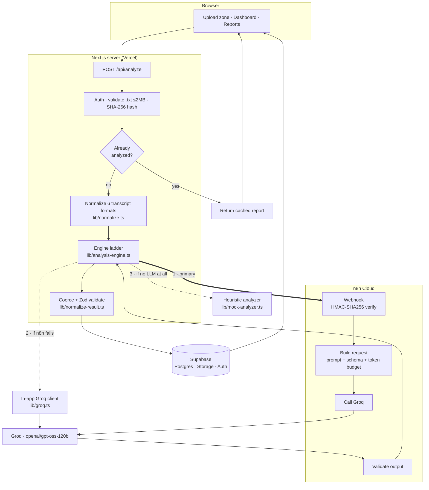

# CallLens — Conversation Intelligence

Upload a `.txt` call transcript and get a full intelligence report: overall **and
sentence-level** sentiment, resolution status, escalation risk, customer
experience, agent quality, emotion signals, derived call KPIs, and the model's
own reasoning with verbatim evidence.

**Stack:** Next.js 14 (App Router) · n8n Cloud orchestration · Groq
`openai/gpt-oss-120b` · Supabase (Postgres + Storage + Auth) · deployable to Vercel.

**Typical analysis: 5–7 seconds end to end.**

---

## Table of contents

- [Assignment → implementation map](#assignment--implementation-map)
- [Architecture](#architecture)
- [Resilience: the engine ladder](#resilience-the-engine-ladder)
- [How to run it](#how-to-run-it)
- [Project layout](#project-layout)
- [Testing and verification](#testing-and-verification)
- [Security](#security)
- [Troubleshooting](#troubleshooting)
- [Known limits](#known-limits)

---

## Assignment → implementation map

| Requirement | Where it lives |
|---|---|
| React / Next.js frontend, Vercel-deployable | Next.js 14 App Router, `app/` |
| Login screen | `app/login`, `app/signup` — instant sign-up, no email step |
| File upload (`.txt`) | `components/analyze/upload-zone.tsx` → `app/api/analyze` |
| Results dashboard | `app/reports/[id]`, `app/dashboard` |
| n8n / agentic orchestration | `n8n/`, `scripts/build-n8n-workflow.mjs`, `lib/n8n.ts` |
| Overall sentiment (positive / negative / neutral) | `overall_sentiment` → `components/reports/kpi-cards.tsx` |
| **Sentence-level sentiment** | `sentences[]` → `components/reports/sentence-table.tsx` |
| KPIs derivable from a phone call | `kpi-cards`, `evidence-cards`, `lib/kpi.ts` |
| AI quality — clear reasoning | `components/reports/reasoning-card.tsx` + per-sentence `evidence` |
| Charts | `sentiment-timeline`, `sentiment-distribution`, `emotion-bars`, `derived-kpis` |
| Emotion detection | `emotions[]` → `components/reports/emotion-bars.tsx` |
| Conversation summary | `summary` → report page |
| Extra features | Reports CRUD, re-run, JSON/CSV export, search, bulk delete, dashboard KPI strip, engine provenance |

---

## Architecture

Clean separation: the **UI never talks to an LLM**. It talks to a Next.js API
route, which delegates orchestration to **n8n**, which calls the model.



### The analysis contract

`lib/analysis-contract.json` is the single source of truth for the model id,
the system prompt, the JSON schema and the token budget.
`scripts/build-n8n-workflow.mjs` bakes it into the n8n Code node at build time;
`lib/groq.ts` reads it at runtime. **Both engines therefore send byte-identical
prompts and cannot drift apart.** Edit the contract → regenerate → re-import.

### Why the n8n call is synchronous

n8n responds with the finished analysis on the same HTTP connection.

An earlier design returned `202 Accepted` and waited for n8n to POST results
back to a callback URL. That can never work in local development — **n8n Cloud
cannot reach `http://localhost:3000`** — so uploads sat on "processing" forever.
Groq answers in ~4s and Vercel allows far more, so the callback route, the
status-polling endpoint and the whole job-state machine were deleted.

---

## Resilience: the engine ladder

Production LLM pipelines fail for boring reasons: the orchestrator cold-starts,
a model gets decommissioned, an API rate-limits, a webhook secret drifts after a
redeploy. Every one of those took this project down at least once during
development.

So analysis runs through a **three-rung ladder** (`lib/analysis-engine.ts`).
Each rung is tried in order; the first success wins.

| # | Engine | Used when | Trade-off |
|---|---|---|---|
| **1** | **n8n → Groq** | Normal operation | The graded architecture: UI → n8n → AI |
| **2** | **In-app Groq** (`lib/groq.ts`) | n8n unreachable, timed out, or rejects | Same model, same prompt; skips orchestration |
| **3** | **Heuristic** (`lib/mock-analyzer.ts`) | No LLM reachable at all | Deterministic, keyword-based, no network |

Rung 2 also **auto-downgrades** `gpt-oss-120b` → `gpt-oss-20b` on a 404, 429 or
5xx, and **honours Groq's `retry-after`** on rate limits instead of giving up —
because the free tier's token budget refills within seconds.

**This is a deliberate production-hardening measure, not a workaround.** The
goal is that a transient failure in the n8n layer degrades the *path*, never the
*user experience*: an upload always produces a report.

### It stays honest

Degrading silently would be worse than failing. Every analysis records which
engine produced it (`analyses.engine`, `model`, `latency_ms`, `degraded`), and
the report header states it plainly:

- `n8n → openai/gpt-oss-120b · 4.2s · schema-validated`
- `Direct Groq fallback (openai/gpt-oss-120b)`
- `Heuristic fallback — no LLM` *(also flagged `degraded`, with a note that
  scores are keyword-derived, not model-derived)*

So a reviewer can always tell whether the orchestrated path actually served the
request.

---

## How to run it

### Prerequisites

- **Node.js 18.17+** (developed on 24.x) and npm
- A **Supabase** project (free tier)
- A **Groq** API key — <https://console.groq.com/keys> (free)
- An **n8n Cloud** instance (free trial) — *optional*; without it the app runs
  on rung 2 of the ladder

### 1. Install

```bash
npm install
```

### 2. Configure

```bash
cp .env.example .env
```

Fill in `.env`:

| Variable | Where to get it | Required |
|---|---|---|
| `NEXT_PUBLIC_SUPABASE_URL` | Supabase → Settings → API | yes |
| `NEXT_PUBLIC_SUPABASE_ANON_KEY` | same page | yes |
| `SUPABASE_SERVICE_ROLE_KEY` | same page (**server-only secret**) | yes |
| `DATABASE_URL` | Supabase → Settings → Database → connection string | migrations only |
| `GROQ_API_KEY` | console.groq.com/keys | yes |
| `N8N_WEBHOOK_URL` | after step 4 | for rung 1 |
| `N8N_WEBHOOK_SECRET` | any strong random string you choose | for rung 1 |
| `AUTH_SECRET` | any strong random string | yes |

### 3. Create the database schema

```bash
node scripts/migrate-supabase.mjs
```

Applies every file in `supabase/migrations/` in order, then verifies the four
tables, the `transcripts` storage bucket and that RLS is enabled.

In the Supabase dashboard, enable **Authentication → Providers → Email**. You do
**not** need to configure SMTP or touch "Confirm email" — see
[Sign-up sends no email](#sign-up-sends-no-email).

### 4. Set up n8n (optional but recommended)

```bash
node scripts/build-n8n-workflow.mjs
```

This writes two files:

| File | Contents | Git |
|---|---|---|
| `n8n/CALLLENS_ANALYZE_CONVERSATION.json` | placeholders | committed |
| `n8n/CALLLENS_ANALYZE_CONVERSATION.local.json` | your real secrets baked in | **gitignored** |

In n8n Cloud:

1. **Deactivate and DELETE any existing CallLens workflow first.** Importing a
   second copy silently leaves the *old* one owning the
   `/webhook/calllens-analyze` path, and your changes appear to do nothing.
2. **Workflows → Import from File** → pick the **`.local.json`**.
3. Open the **Config** node and confirm neither value still reads `PASTE_…`.
4. **Save**, then toggle **Active**.
5. Copy the **production** webhook URL (`/webhook/…`, *not* `/webhook-test/…`)
   into `N8N_WEBHOOK_URL`.

Verify without opening a browser:

```bash
node scripts/test-n8n.mjs
```

### 5. Run

```bash
npm run dev
```

Open <http://localhost:3000> → **Create an account** → sign in → **Analyze** →
upload any file from `samples/`.

> **Do not run `npm run build` while `npm run dev` is running.** They share the
> `.next` directory; mixing production and dev artifacts makes the dev server
> serve a 404 for its own stylesheet, and the app renders completely unstyled.
> If that happens: stop dev, delete `.next`, start dev again.

### Production build

```bash
npm run build && npm start
```

### Deploying to Vercel

Set every variable from `.env` in the Vercel project (Settings → Environment
Variables). `app/api/analyze/route.ts` exports `maxDuration = 60`, within the
Hobby limit; the whole ladder is budgeted to fit inside it.

### Sign-up sends no email

`signUpUser()` (`lib/auth/index.ts`) creates accounts with the service-role
`auth.admin.createUser({ email_confirm: true })` rather than `auth.signUp()`.
The row is written to the database already confirmed, so the user can sign in
the moment they submit the form:

```
/signup → written to auth.users + profiles → /login → /dashboard
```

`auth.signUp()` was abandoned because it always runs the project's confirmation
flow, making sign-up depend on Supabase's built-in mailer (~2 messages/hour on
the free tier). When it refused to send, sign-up failed and **no user was
created at all**.

Credentials still live in Supabase Auth (bcrypt-hashed by Postgres), the
`on_auth_user_created` trigger still populates `public.profiles`, and RLS still
keys off `auth.uid()` — the security model is unchanged.

---

## Project layout

```
app/
  page.tsx                    landing
  login/ signup/              auth screens
  dashboard/                  KPI strip + recent analyses
  analyze/                    upload screen
  reports/  reports/[id]/     list + full report dashboard
  auth/callback/              redeems Supabase links (legacy + password reset)
  api/
    analyze/                  the browser's only analysis entry point
    auth/                     login · signup · logout · me
    reports/                  list · [id] GET/PATCH/DELETE · rerun
                              · export (JSON/CSV) · bulk-delete

components/
  analyze/upload-zone         drag-drop, progress, engine chip
  reports/                    kpi-cards · sentiment-distribution · emotion-bars
                              evidence-cards · why-card · reasoning-card
                              derived-kpis · key-moments · sentence-table
                              provenance-strip · report-actions
                              edit-report-dialog · confirm-dialog · reports-list
  charts/sentiment-timeline   Recharts line chart
  ui/                         shadcn primitives (only the ones actually used)

lib/
  analysis-contract.json      model + prompt + schema + token budget  ← shared with n8n
  analysis-engine.ts          the three-rung ladder
  n8n.ts                      HMAC-signed webhook transport
  groq.ts                     in-app fallback client (server-only)
  normalize-result.ts         coerce any LLM variant → canonical shape
  normalize.ts                6 transcript formats → canonical turns
  mock-analyzer.ts            deterministic heuristic engine
  validation.ts               Zod schemas + LIMITS (single source for caps)
  kpi.ts                      derived call KPIs (pure, testable)
  db/                         store interface + Supabase and local impls
  auth/  supabase/  storage · hash · rate-limit · csv · errors · format · config

n8n/                          importable workflow + prompt/schema doc
scripts/                      build-n8n-workflow · test-n8n · migrate-supabase
supabase/migrations/          0001_init · 0002_report_metadata
samples/                      8 transcripts covering all 6 supported formats
```

### Supported transcript formats

`lib/normalize.ts` detects and normalizes six shapes, each with a sample:

| Format | Sample |
|---|---|
| Labeled dialogue | `labeled-dialogue.txt` |
| Timestamped | `timestamped-call.txt` |
| SRT captions | `caption-srt.txt` |
| CSV/TSV export | `csv-style-export.txt` |
| Unlabeled turns | `unlabeled-prose.txt` |
| Realistic calls | `call-billing-dispute.txt`, `call-frustrated-churn.txt`, `call-sales-discovery.txt` |

---

## Testing and verification

```bash
npm run typecheck     # tsc --noEmit
npm run lint          # next lint
node scripts/test-n8n.mjs                  # live n8n round-trip, asserts 10 checks
node scripts/test-n8n.mjs --bad-signature  # must be REJECTED
node scripts/test-n8n.mjs --file samples/call-frustrated-churn.txt
```

`test-n8n.mjs` signs a real payload, POSTs it, and asserts the envelope, the KPI
fields, one sentence per turn, evidence coverage, reasoning drivers and latency.

To exercise the ladder deliberately: point `N8N_WEBHOOK_URL` at an unreachable
host (falls to rung 2), then also blank `GROQ_API_KEY` (falls to rung 3). In
both cases the upload must still succeed and the engine chip must say so.

---

## Security

- **The browser never sees an LLM key.** `lib/groq.ts` starts with
  `import 'server-only'`; `GROQ_API_KEY` must never gain a `NEXT_PUBLIC_` prefix.
- Every n8n request is **HMAC-SHA256 signed**; the workflow recomputes the
  digest and rejects mismatches.
- **Zod validation on both sides** of the n8n boundary, and again before persist.
- **RLS** on all four tables; storage objects scoped to the uploading user.
- CSV export escapes leading `= + - @` to block spreadsheet formula injection.
- Post-login redirects reject protocol-relative URLs (`//evil.com`).
- Security headers + CSP in `next.config.mjs`.
- `.env` is gitignored; `.env.example` contains placeholders only.

---

## Troubleshooting

**The app is completely unstyled.**
`.next` has mixed dev/production artifacts. Stop the dev server, delete `.next`,
restart. Don't run `npm run build` while `npm run dev` is running.

**Reports show `Resolution: Unknown` and `Escalation Risk: —`.**
The analysis came from an older build. Use **Re-run analysis** in the report's
actions menu — the original transcript is still stored.

**The engine chip says "Direct Groq fallback" instead of n8n.**
n8n didn't answer in time or rejected the request. Run
`node scripts/test-n8n.mjs` for the exact reason. On the free tier, the first
call after an idle period can cold-start for 10–20s — run one throwaway analysis
before demoing.

**`node scripts/test-n8n.mjs` reports "Invalid signature".**
The `Config` node in n8n doesn't hold the same `N8N_WEBHOOK_SECRET` as `.env`.
Rebuild and re-import the `.local.json` (deleting the old workflow first).

**A correctly-signed request returns HTTP 200 with an empty body.**
The signature passed, but a Code node threw and aborted the execution before any
Respond node could run — n8n then closes the connection with nothing.

The usual cause is a **Node global that the Code sandbox doesn't expose**. The
sandbox provides `require()`'d builtins but *not* `Buffer`, `process`,
`setImmediate` or `__dirname`. One `Buffer.byteLength()` call in `Call Groq` was
enough to break every run while leaving no trace outside the Executions log.

This is now defended three ways, so it should not recur:

1. every Code node wraps its body in `try/catch` and returns a diagnostic
   instead of throwing;
2. every Code node sets `onError: continueRegularOutput`, so even an unexpected
   throw keeps the item flowing to a Respond node;
3. `scripts/build-n8n-workflow.mjs` **fails the build** if any Code node
   references a forbidden global.

If you still see it, open n8n → **Executions**, click the failed run, and look
for the red node. Re-import the freshly generated `.local.json`.

---

## Known limits

- **Groq free tier: 8,000 tokens/minute.** A request is admitted only if
  `prompt + max_completion_tokens` fits, so the completion budget is sized
  dynamically (`planRequest()` in `lib/groq.ts`, mirrored in the n8n Build
  Request node). Sustained throughput is roughly one upload every 15s.
- **n8n Cloud free tier cold-starts** for 10–20s after idling. The first call of
  a server process gets a longer budget (`N8N_COLD_START_TIMEOUT_MS`).
- Transcripts are capped at 250 turns / ~16k characters of dialogue; anything
  beyond is reported as truncated rather than silently dropped.
- Rate limiting uses an in-memory limiter unless Upstash is configured
  (6 analyses / 10 min per user; cached hits exempt).
- `npm run dev` occasionally crashes its own error logger on 500s (a Next.js
  quirk on Windows); `npm run build && npm start` is stable.
