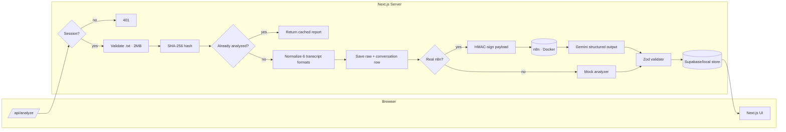

# CallLens — Conversation Intelligence

Upload a call transcript, get back a full intelligence report: sentiment,
resolution status, escalation risk, customer experience, agent quality,
emotion signals and a sentence-level breakdown — powered by an n8n-orchestrated
Gemini pipeline.

Two modes, zero code changes:

| | **Demo mode** (default) | **Live mode** (`.env.local` filled) |
|---|---|---|
| Auth | HMAC cookie, demo user `demo@calllens.local` / `calllens` | Supabase Auth |
| Storage | `.local-store/db.json` (file-based) | Supabase Postgres + Storage |
| Analyzer | Deterministic local mock | n8n → Gemini via HMAC webhook |

## Architecture



```
app/
  (auth) login · middleware guard · api/auth/*
  api/analyze            ← browser entry point (§8.1 pipeline)
  api/analyze/status/[id]
  api/reports, api/reports/[id]
  api/n8n-callback       ← webhook acknowledgment path
  dashboard / analyze / reports / reports/[id]
components/   shadcn/ui primitives + app shell + report widgets
lib/          config · auth/session · db/{store,local,supabase} · storage
              normalize · n8n · mock-analyzer · validation · errors · hash
              rate-limit · format · utils · types
infra/        docker-compose (n8n) + cloudflared tunnel config
n8n/          LLM prompt+schema, importable workflow JSON
scripts/      build-n8n-workflow.mjs (regenerate workflow JSON)
supabase/     migrations/0001_init.sql (schema + RLS + storage policies)
samples/      five transcript format samples (also test fixtures)
```

## Quick start (demo mode)

```bash
npm install
npm run dev          # http://localhost:3000
```

Sign in with `demo@calllens.local` / `calllens`, upload one of the
`samples/*.txt` transcripts, and explore the report.

Re-running the same file returns the cached result instantly (SHA-256
idempotency — the LLM is never re-billed).

## Going live

1. **Supabase**: create project, run `supabase/migrations/0001_init.sql`,
   copy `.env.example` → `.env.local`, fill `NEXT_PUBLIC_SUPABASE_URL`,
   `NEXT_PUBLIC_SUPABASE_ANON_KEY`, `SUPABASE_SERVICE_ROLE_KEY`.
2. **n8n + Gemini**: `docker compose -f infra/docker-compose.yml up -d`,
   open `http://127.0.0.1:5678`, import
   `n8n/CALLLENS_ANALYZE_CONVERSATION.json`, then paste the webhook secret
   and Gemini key into the two Set nodes (see `n8n/LLM_PROMPT_AND_SCHEMA.md`
   for the full contract). Fill `N8N_WEBHOOK_URL`, `N8N_WEBHOOK_SECRET`,
   `GEMINI_API_KEY`.
3. **(Optional)** `UPSTASH_REDIS_REST_URL` + `UPSTASH_REDIS_REST_TOKEN` for
   distributed rate limiting; otherwise an in-memory limiter is used
   (6 analyses / 10 min per user, cached hits exempt).
4. `npm run build && npm start`.

The Cloudflare-tunnel profile (`--profile tunnel`) exposes n8n to the
public webhook URL without opening inbound ports.

## Security notes

- Browser → server only; `lib/n8n.ts` signs every webhook request with
  HMAC-SHA256 (`N8N_WEBHOOK_SECRET`); n8n verifies it in a Code node and
  rejects invalid signatures with 401.
- Zod validation on both sides of the n8n boundary (schema in
  `n8n/LLM_PROMPT_AND_SCHEMA.md`), plus re-validation before persist.
- RLS-enabled Postgres schema; storage buckets locked to the uploader.
- Security headers via `next.config.mjs`; `AUTH_SECRET` for cookie signing
  (demo fallback exists, never use it in production).

## Known limitations

- `npm run dev` occasionally crashes its own error logger on 500s (Next.js
  inspect quirk on Windows); `npm run build && npm start` is stable.
- Analysis is synchronous today; the `/api/n8n-callback` + status route
  scaffold supports async fallback.