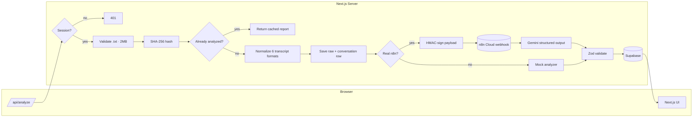

# CallLens — Conversation Intelligence

Upload a call transcript, get back a full intelligence report: sentiment,
resolution status, escalation risk, customer experience, agent quality,
emotion signals and a sentence-level breakdown — powered by an n8n Cloud +
Gemini pipeline with Supabase storage and Supabase Auth (self-service sign-up).

| | **Demo mode** (no env) | **Live mode** (`.env.local` filled) |
|---|---|---|
| Auth | HMAC cookie, demo user `demo@calllens.local` / `calllens` | Supabase Auth (create account → sign in) |
| Storage | `.local-store/db.json` (file-based) | Supabase Postgres + Storage |
| Analyzer | Deterministic local mock | n8n Cloud → Gemini via HMAC webhook |

## Architecture



```
app/
  login / signup           ← Supabase Auth (email + password)
  api/analyze              ← browser entry point (§8.1 pipeline)
  api/analyze/status/[id]
  api/auth/*               ← login / signup / logout / me
  api/reports, api/reports/[id]
  dashboard / analyze / reports / reports/[id]
components/   shadcn/ui primitives + app shell + report widgets
lib/          config · auth/session · db/{store,local,supabase} · storage
              normalize · n8n · mock-analyzer · validation · errors · hash
              rate-limit · format · utils · types
n8n/          LLM prompt+schema, importable workflow JSON
scripts/      build-n8n-workflow.mjs (regenerate workflow JSON)
supabase/     migrations/0001_init.sql (schema + RLS + storage policies)
samples/      five transcript format samples (also test fixtures)
```

## Quick start (demo mode)

```bash
npm install
npm run dev          # http://localhost:3000
```

Sign in with `demo@calllens.local` / `calllens`, upload one of the
`samples/*.txt` transcripts, and explore the report. Re-running the same file
returns the cached result instantly (SHA-256 idempotency — the LLM is never
re-billed).

## Going live

### 1. Supabase (database + auth)

1. Create a project; run `supabase/migrations/0001_init.sql` (tables, RLS,
   storage bucket, and the trigger that auto-creates a `profiles` row for every
   new sign-up).
2. Authentication → Providers → Email: **disable "Confirm email"** so new
   accounts can sign in immediately (or keep it on — the app shows a
   "check your email" screen).
3. Copy `.env.example` → `.env.local`, fill `NEXT_PUBLIC_SUPABASE_URL`,
   `NEXT_PUBLIC_SUPABASE_ANON_KEY`, `SUPABASE_SERVICE_ROLE_KEY`.

### 2. n8n Cloud + Groq (fast — fits Vercel Hobby's 10s cap)

Gemini takes 8–15s and trips Vercel Hobby's 10s function limit. The pipeline
uses **Groq** (`llama-3.3-70b-versatile`, ~1–3s) instead, which keeps the whole
round-trip well inside the cap. Get a free key at https://console.groq.com/keys.

1. Create a free n8n Cloud instance (`<your-sub>.app.n8n.cloud`).
2. **Import the workflow** — either:
   - **Recommended:** import `n8n/CALLLENS_ANALYZE_CONVERSATION.json`, then open
     the **Config** Code node and set `N8N_WEBHOOK_SECRET` (must equal the app's
     `N8N_WEBHOOK_SECRET`) and `GROQ_API_KEY` (your Groq key); or
   - run `node scripts/build-n8n-workflow.mjs` with `GROQ_API_KEY` exported to
     bake the key straight into the generated file, then import.
3. Activate the workflow (toggle). Test:
   `curl -X POST https://<your-sub>.app.n8n.cloud/webhook/calllens-analyze -H "Content-Type: application/json" -d '{}'`
   → expect a 401-style rejection (proves it's live), and a valid analysis JSON
   with a correctly HMAC-signed request.
4. In `.env.local`: `N8N_WEBHOOK_URL=https://<your-sub>.app.n8n.cloud/webhook/calllens-analyze`
   and `N8N_WEBHOOK_SECRET=<exact same secret as in the Config node>`.

### 3. Vercel

Set the same env vars in the Vercel project (plus `AUTH_SECRET` — a strong
value, identical across deploys). No local n8n or tunnel needed — the app only
talks to the public n8n webhook.

## Security notes

- Browser → server only; `lib/n8n.ts` signs every webhook request with
  HMAC-SHA256 (`N8N_WEBHOOK_SECRET`); n8n verifies it in a Code node and
  rejects invalid signatures.
- Zod validation on both sides of the n8n boundary (schema in
  `n8n/LLM_PROMPT_AND_SCHEMA.md`), plus re-validation before persist.
- RLS-enabled Postgres schema; storage buckets locked to the uploader.
- Security headers via `next.config.mjs`; `AUTH_SECRET` for cookie signing.

## Known limitations

- `npm run dev` occasionally crashes its own error logger on 500s (Next.js
  inspect quirk on Windows); `npm run build && npm start` is stable.
- Analysis is synchronous; on Vercel the function must run long enough for
  Gemini (export `maxDuration` in `app/api/analyze/route.ts`; Hobby's 10 s cap
  may be too tight — Pro recommended).
- Rate limiting falls back to an in-memory limiter unless Upstash is set
  (6 analyses / 10 min per user, cached hits exempt).
