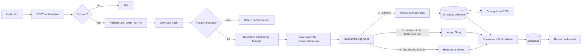

# CallLens — Conversation Intelligence

Upload a `.txt` call transcript, get back a full intelligence report: overall
and sentence-level sentiment, resolution status, escalation risk, customer
experience, agent quality, emotion signals, derived call KPIs and the model's
own reasoning — orchestrated through **n8n Cloud → Groq**, with Supabase
Postgres, Supabase Storage and Supabase Auth.

| | **Demo mode** (no env) | **Live mode** (`.env` filled) |
|---|---|---|
| Auth | HMAC cookie, demo user `demo@calllens.local` | Supabase Auth (sign up → sign in) |
| Storage | `.local-store/db.json` (file-based) | Supabase Postgres + Storage |
| Analyzer | Deterministic heuristic | n8n Cloud → Groq `openai/gpt-oss-120b` |

Typical live analysis: **~5–7 seconds** end to end.

## Assignment → implementation map

| Requirement | Where it lives |
|---|---|
| React / Next.js frontend, deployable on Vercel | Next.js 14 App Router, `app/` |
| Login screen | `app/login`, `app/signup` → Supabase Auth |
| File upload (`.txt`) | `components/analyze/upload-zone.tsx` → `app/api/analyze` |
| Results dashboard | `app/reports/[id]`, `app/dashboard` |
| n8n / agentic orchestration | `n8n/`, `scripts/build-n8n-workflow.mjs`, `lib/n8n.ts` |
| Overall sentiment (pos/neg/neutral) | `overall_sentiment` → `components/reports/kpi-cards.tsx` |
| **Sentence-level sentiment** | `sentences[]` → `components/reports/sentence-table.tsx` |
| KPIs derivable from a phone call | `components/reports/{kpi-cards,evidence-cards}.tsx` + `lib/kpi.ts` |
| Clear reasoning (LLM) | `components/reports/reasoning-card.tsx`, per-sentence `evidence` |
| Charts | `sentiment-timeline`, `sentiment-distribution`, `emotion-bars`, `derived-kpis` |
| Emotion detection | `emotions[]` → `components/reports/emotion-bars.tsx` |
| Conversation summary | `summary` → report page |
| Extra features | Reports CRUD, re-run, JSON/CSV export, search, bulk delete, dashboard KPI strip |

## Architecture



**The call is synchronous.** n8n responds with the finished analysis on the same
connection. An earlier design returned `202` and waited for n8n to POST results
back to `/api/analyze/callback`, but n8n Cloud cannot reach
`http://localhost:3000`, so that callback never arrived in local development and
uploads sat on "processing" forever. Groq answers in ~4s and Vercel allows far
more than that, so the callback, the status-polling endpoint and the job-state
machine were all removed.

**The fallback ladder** guarantees an upload never ends on an error screen,
without ever misrepresenting what ran: every report shows an engine chip
(`n8n → model`, `Direct Groq fallback`, or `Heuristic fallback — no LLM`) and
the heuristic path is explicitly marked `degraded`.

```
app/
  login / signup           ← Supabase Auth (email + password)
  api/analyze              ← the browser's only analysis entry point
  api/auth/*               ← login / signup / logout / me
  api/reports              ← list (filter · search · sort · paginate)
  api/reports/[id]         ← GET detail · PATCH metadata · DELETE
  api/reports/[id]/rerun   ← re-analyze a stored transcript in place
  api/reports/[id]/export  ← single report as JSON or sentences as CSV
  api/reports/bulk-delete  ← multi-select delete
  api/reports/export       ← all reports as CSV
  dashboard / analyze / reports / reports/[id]
components/   shadcn/ui primitives + app shell + report widgets
lib/          analysis-contract.json  ← prompt + schema, shared with n8n
              analysis-engine · n8n · groq · normalize-result · mock-analyzer
              config · auth/session · db/{store,local,supabase} · storage
              normalize · validation · errors · hash · rate-limit · kpi · csv
n8n/          importable workflow JSON + prompt/schema doc
scripts/      build-n8n-workflow.mjs · test-n8n.mjs · migrate-supabase.mjs
supabase/     migrations/0001_init.sql · 0002_report_metadata.sql
samples/      nine transcript samples covering every supported format
```

### One contract, two engines

`lib/analysis-contract.json` holds the model id, the token budget, the system
prompt and the JSON schema. `scripts/build-n8n-workflow.mjs` bakes it into the
n8n Code node at build time, and `lib/groq.ts` reads it at runtime. The primary
and fallback engines therefore send byte-identical prompts and cannot drift
apart. Edit the contract, re-run the generator, re-import.

## Quick start (demo mode)

```bash
npm install
npm run dev
```

Open <http://localhost:3000>, sign in with `demo@calllens.local` (password from
`DEMO_USER_PASSWORD`, default `calllens`), and upload one of the `samples/*.txt`
transcripts. Re-uploading the same file returns the cached report instantly
(SHA-256 idempotency — the LLM is never re-billed).

## Going live

### 1. Supabase (database + auth)

```bash
node scripts/migrate-supabase.mjs
```

Applies every file in `supabase/migrations/` in order and verifies the tables,
the `transcripts` bucket and RLS. Needs `DATABASE_URL` in `.env`.

Then in the Supabase dashboard: **Authentication → Providers → Email: enable
"Email"**. Disabling **"Confirm email"** lets new accounts sign in immediately,
which is what you want for a demo — otherwise sign-up stops at "check your
inbox".

Copy `.env.example` → `.env` and fill `NEXT_PUBLIC_SUPABASE_URL`,
`NEXT_PUBLIC_SUPABASE_ANON_KEY`, `SUPABASE_SERVICE_ROLE_KEY`.

### 2. n8n Cloud + Groq

Get a free Groq key at <https://console.groq.com/keys> and set `GROQ_API_KEY`
and `N8N_WEBHOOK_SECRET` (any strong random string) in `.env`. Then:

```bash
node scripts/build-n8n-workflow.mjs
```

This writes **two** files:

- `n8n/CALLLENS_ANALYZE_CONVERSATION.json` — placeholders, safe to commit
- `n8n/CALLLENS_ANALYZE_CONVERSATION.local.json` — real secrets, gitignored

In n8n Cloud: **deactivate and DELETE any existing CallLens workflow first** — a
second import silently leaves the old one owning the `/webhook/calllens-analyze`
path — then import the `.local.json`, confirm the **Config** node holds real
values (not `PASTE_…`), save, and **Activate**.

Set `N8N_WEBHOOK_URL=https://<your-sub>.app.n8n.cloud/webhook/calllens-analyze`
in `.env`, then verify without touching the browser:

```bash
node scripts/test-n8n.mjs
```

It signs a real payload, POSTs it, and asserts the response shape, the KPI
fields and the latency. `node scripts/test-n8n.mjs --bad-signature` must be
rejected.

### 3. Vercel

Set the same env vars in the Vercel project, plus `AUTH_SECRET` (strong, stable
across deploys). `app/api/analyze/route.ts` exports `maxDuration = 60`, which is
within the Hobby limit; the whole ladder is budgeted to fit inside it.

## Security notes

- Browser → server only. `lib/n8n.ts` HMAC-SHA256-signs every webhook request;
  n8n recomputes the digest and rejects mismatches.
- `GROQ_API_KEY` is used only in `lib/groq.ts`, which starts with
  `import 'server-only'`. Never give it a `NEXT_PUBLIC_` prefix.
- Zod validation on both sides of the n8n boundary, and again before persist.
- RLS-enabled schema; storage objects scoped to the uploading user.
- CSV export escapes leading `= + - @` to block spreadsheet formula injection.
- Security headers + CSP via `next.config.mjs`; `AUTH_SECRET` signs demo cookies.

## Known limitations

- **Groq free tier: 8,000 tokens/minute.** A request is admitted only if
  `prompt + max_completion_tokens` fits, so the completion budget is sized
  dynamically (`planRequest()` in `lib/groq.ts`, mirrored in the n8n Build
  Request node). Sustained throughput is roughly one upload every 15s; back-to-
  back uploads may hit a 429 and fall through to the next engine.
- **n8n Cloud free tier cold-starts** for 10–20s after idling. The first call of
  a server process gets a longer budget (`N8N_COLD_START_TIMEOUT_MS`), but if it
  still times out the analysis silently succeeds on the direct-Groq fallback —
  the engine chip will say so. Run one throwaway analysis before demoing.
- Transcripts are capped at `MAX_ANALYZED_TURNS` (250) turns and ~16k characters
  of dialogue; anything beyond that is reported as truncated rather than
  silently dropped.
- Rate limiting falls back to an in-memory limiter unless Upstash is configured
  (6 analyses / 10 min per user; cached hits are exempt).
- `npm run dev` occasionally crashes its own error logger on 500s (a Next.js
  quirk on Windows); `npm run build && npm start` is stable.
